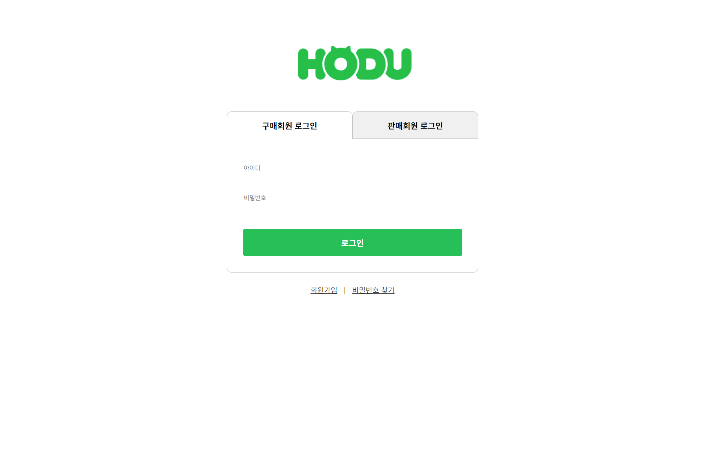

# Open Market Project

> 누구나 상품을 판매하고 구매할 수 있는 오픈마켓 플랫폼  
> 바닐라 JavaScript 기반 SPA로 구현된 개인 프로젝트입니다.

---

## 🔗 배포 링크

[👉 GitHub Pages에서 보기](https://kth1257.github.io/open-market-project/)

---

## 📌 프로젝트 정보

- **프로젝트명**: Open Market SPA  
- **기간**: 2025년 6월16일 ~ 2025년6월23일 (8일)
- **인원**: 1인 개발  
- **방식**: CSR 기반 SPA  
- **기술스택**: HTML, CSS, JavaScript  
- **API**: 위니브 오픈마켓 API 사용

---

## 🔧 주요 기능

### ✅ 인증
- 구매자 / 판매자 로그인 및 회원가입
- JWT 토큰 기반 인증
- 비로그인 시 구매/장바구니 제한 + 모달 안내

### ✅ 상품
- 캐러셀 포함 상품 목록 페이지
- 상품 클릭 시 상세 페이지 이동
- 수량 조절 & 총 가격 실시간 계산

### ✅ SPA 라우팅
- `location.hash` + `hashchange` 이벤트로 라우터 구현
- 페이지: 메인 / 로그인 / 회원가입 / 상품 상세

### ✅ UI/UX
- 헤더, 푸터 컴포넌트 분리
- 탭 메뉴 active 처리
- visually-hidden으로 접근성 고려
- 반응형 레이아웃 준비

---

## 📁 폴더 구조

```

src/
├── api/            # API 함수
├── assets/
│   ├── images/     # 정적 이미지 파일
│   └── screens/    # README에 쓰일 화면 캡처 이미지
├── components/     # Header, Footer, Carousel 등
├── constants/      # 공통 상수
├── pages/          # 각 페이지 JS
├── router/         # SPA 라우터
├── styles/         # CSS
└── utils/          # 세션 유틸 함수

```

---

## 👀 화면 미리 보기

### 🔸 메인 페이지


### 🔸 로그인 페이지


### 🔸 회원가입 페이지


### 🔸 상품 상세 페이지


### 🔸 로그인 필요 시 모달


---

## 🙋‍♂️ 개발자

**김태훈 (Taehun Kim)**

- GitHub: [@kth1257](https://github.com/kth1257)
- Velog: [velog.io/@ase777](https://velog.io/@ase777)

---
